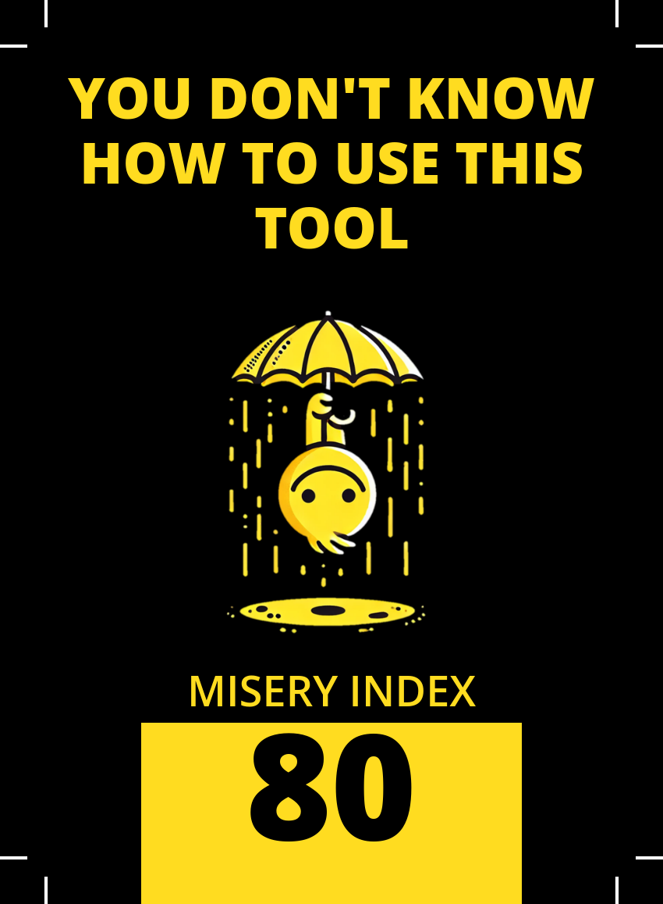
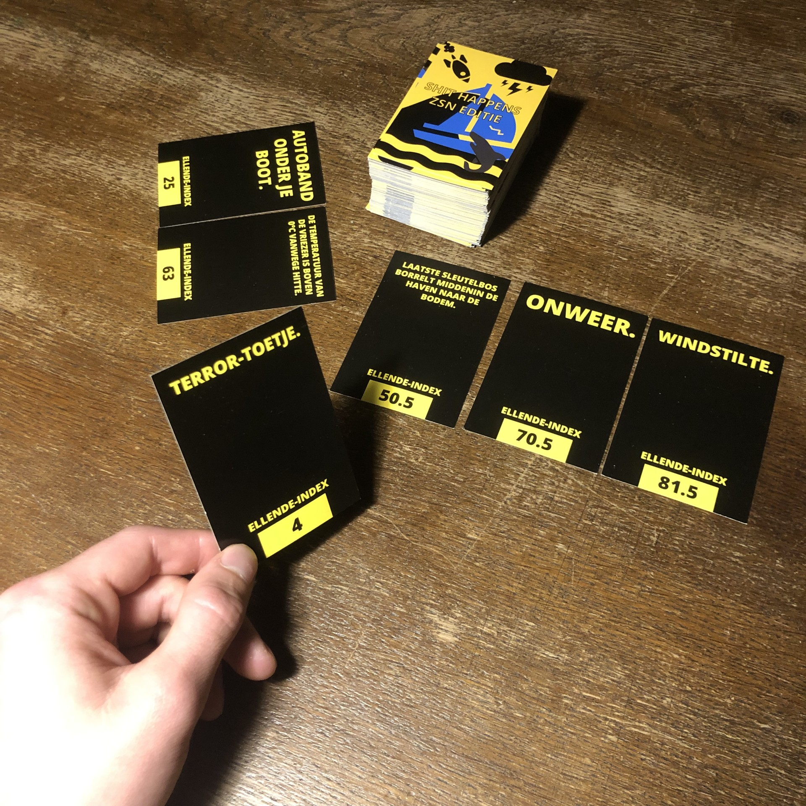

## Background
[Shit Happens](https://boardgamegeek.com/boardgame/196379/shit-happens) is an awesome game where you have to guess how miserable a situation is.
Each card depicts a horrible event that you _might_ go through sometime in your life.
The events have a misery index and you have to guess how miserable the event is compared to other cards you already guessed right.

You might find yourself in similar situations at work, the sports club, on the street, or in space.
They all deserve a place in this game, but they are probably not included in the original game.

But that is no problem, because you can make your own cards with [It Happens](https://ithappens.streamlit.app)!


## Get started
To get started, go to [ithappens.streamlit.app](https://ithappens.streamlit.app).
Download the example yaml file and start editing it.
Optionally, you may specify an image for every situation.
Leave empty if you don't want to have an image.

```yaml
- situation: You don't know how to use this tool
  misery index: 80
  image: umbrella.png
- situation: This is just an example
  misery index: 1
  image: simple stick figure.png
```

When you have enough situations, upload the yaml file and optionally the images.
Click "Create cards" and wait for the app to finish.
Download the cards, go to your local printer shop, let them cut using the crop marks, and voilà, you now have your custom It Happens cards!

## Development
It Happens is open source ([siemdejong/ithappens](https://github.com/siemdejong/ithappens)) and available under the GNU General Public License v3.0.
Contributions welcome!

## Examples


  
  

